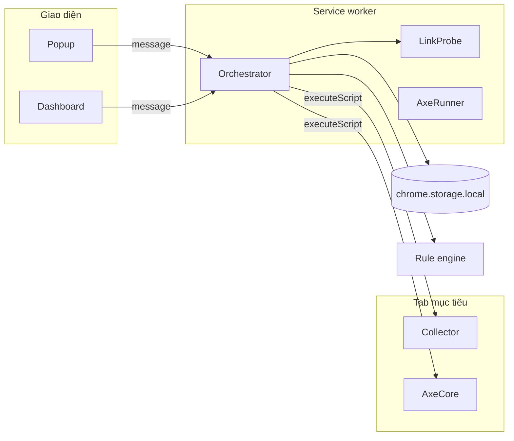

# Kiến trúc hệ thống

```mermaid
flowchart LR
  subgraph ui [Giao diện]
    Popup
    Dashboard
  end
  subgraph sw [Service worker]
    Orchestrator
    LinkProbe
    AxeRunner
  end
  subgraph page [Tab mục tiêu]
    Collector
    AxeCore
  end
  Popup -->|message| Orchestrator
  Dashboard -->|message| Orchestrator
  Orchestrator -->|executeScript| Collector
  Orchestrator -->|executeScript| AxeCore
  Orchestrator --> LinkProbe
  Orchestrator --> Storage[(chrome.storage.local)]
  Orchestrator --> Rules[Rule engine]
```

Luồng dữ liệu: snapshot JSON thuần → rule engine thuần (dễ unit test) → findings → stats → storage → UI/báo cáo.

Trạng thái lâu dài không nằm biến global của worker.
