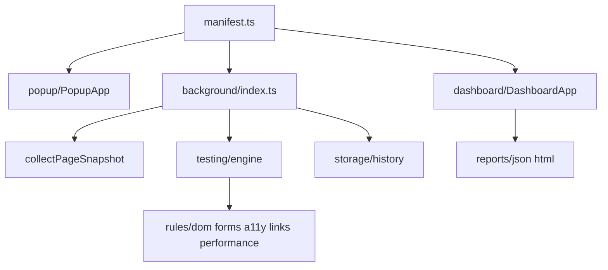

# Sơ đồ thành phần

```mermaid
flowchart TB
  manifest[manifest.ts]
  popup[popup/PopupApp]
  dash[dashboard/DashboardApp]
  bg[background/index.ts]
  collect[collectPageSnapshot]
  engine[testing/engine]
  rules[rules/dom forms a11y links performance]
  store[storage/history]
  reports[reports/json html]
  manifest --> popup
  manifest --> dash
  manifest --> bg
  bg --> collect
  bg --> engine
  engine --> rules
  bg --> store
  dash --> reports
```

Module kiểm thử không phụ thuộc Chrome API, trừ `linkProbe` (fetch) và `axeRunner` (scripting).
