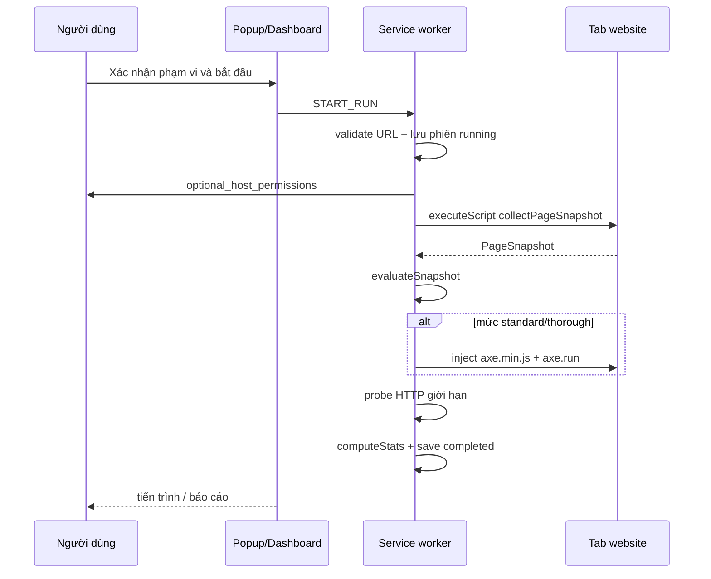

# Sơ đồ luồng thực hiện kiểm thử

```mermaid
sequenceDiagram
  participant U as Người dùng
  participant P as Popup/Dashboard
  participant SW as Service worker
  participant T as Tab website
  U->>P: Xác nhận phạm vi và bắt đầu
  P->>SW: START_RUN
  SW->>SW: validate URL + lưu phiên running
  SW->>U: optional_host_permissions
  SW->>T: executeScript collectPageSnapshot
  T-->>SW: PageSnapshot
  SW->>SW: evaluateSnapshot
  alt mức standard/thorough
    SW->>T: inject axe.min.js + axe.run
  end
  SW->>SW: probe HTTP giới hạn
  SW->>SW: computeStats + save completed
  P-->>U: tiến trình / báo cáo
```
